# The Challenge:
This code is designed to extract the boundary of a supersonic jet of air moving over a Coanda surface from Schlieren
images.
The data set is a set of images of the jet boundary taken at different slot widths and pressures [1].
Schlieren is a technique to take images of transparent media such as fluid flow [1].

Below is a sample jet. The black curved part of the image is the Coanda Flare and the brighter part of the image is air.
The jet can be seen in the brightest parts of the image. It follows the curved surface due to the Coanda effect.
The jet starting location is labeled as well as the dimension considered to be the slot width.
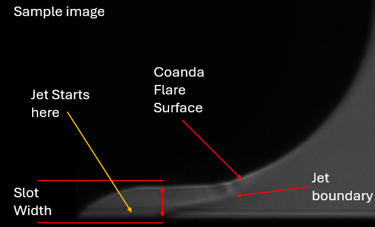

This data was taken to determine a polynomial of the jet boundary and also to understand the shock cell structure [1].
Understanding the shock cell structure in these flows directly correlates to understanding sound generation [2].
Coanda flows are present in rocketry where acoustic loading can actually damage vehicles and the atmosphere [2, 3].
Modeling the shock cells and, thus, the sound generation will allow systems to be optimized to reduce acoustic loading.
To model shock cells the jet boundary must first be characterized.
Previous work has used hand selected points of the boundary, creating significant errors in jet boundary models.

This code seeks to see if the jet boundary can be extracted using Canney edge detection.
The project also seeks to understand how the jet boundary responds to slot width and pressure changes by
creating lines of best fit to quantify the changes in the boundary.

# What you need:
This project requires Numpy, OpenCV, and Matplotlib.
Scipy is optional to play with some edge detection algorithms I created.
I recommend using ImageJ to tare images. The images can be tared in OpenCV but ImageJ makes it really easy to run
basic preprocessing and create and apply masks if needed.

# File List and Guide
The primary files are listed below
1. Canney Find Edge Calibration: This file allows the user to figure out what Canney Thresholds and filter parameters
    are best for a data set using a simple GUI
2. Q1 is the data viable: This file demonstrates that the boundary edge can be found.
3. Q2 impact of pressureV2: This file detects and plots the changes in the jet boundary due to changes in pressure
4. Q3 impact of slotwidth: This file detects and plots the changes in the jet boundary due to changes in Slot Width

Optional files:
1. FindEdgeScan: attempt to write an algorithm to find the boundary
2. FindEdgeScan2: attempt to write an algorithm to find the boundary
3. FindEdgeScan3: attempt to write an algorithm to find the boundary
4. FindEdgeScanD: attempt to write an algorithm to find the boundary
5. Q2 impact of pressure: Older version

# How to use
**Pre-processing:**
To use this code a set of tared images need to be made. This can be done in open CV by subtracting two grayscale images
from each other. I will demonstrate how I preprocessed the images using ImageJ because I needed to generate a mask for
some images as well. Future iterations of this code would be able to perform these operations automatically or imageJ
would be used to preprocess the entire dataset in a few steps.

To tare an image you take a background image and subtract it from an image with a jet to highlight the jet.
This data set did not include any true background images so I found images that had the same slotwidth and used an
image with a pressure so low that the jet couldn't be seen.
Without this pre-processing step the edge selection doesn't really work.

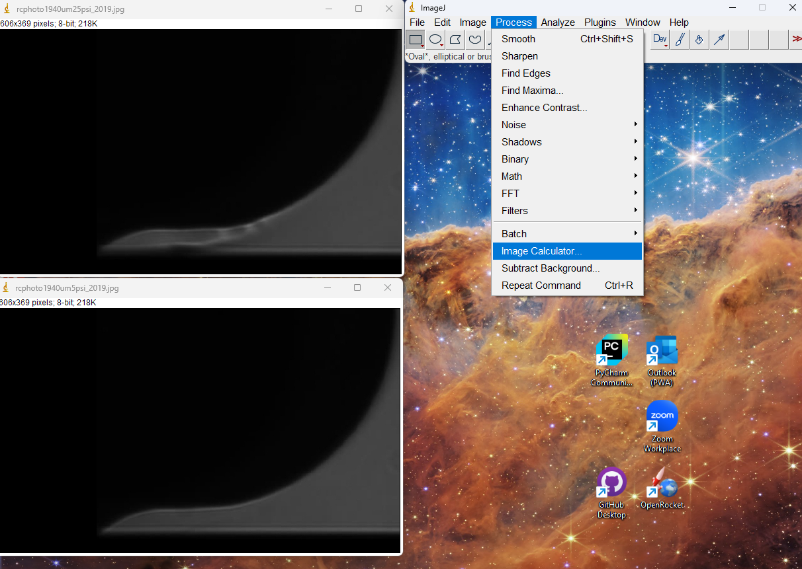
load the files into ImageJ and find the image calculator

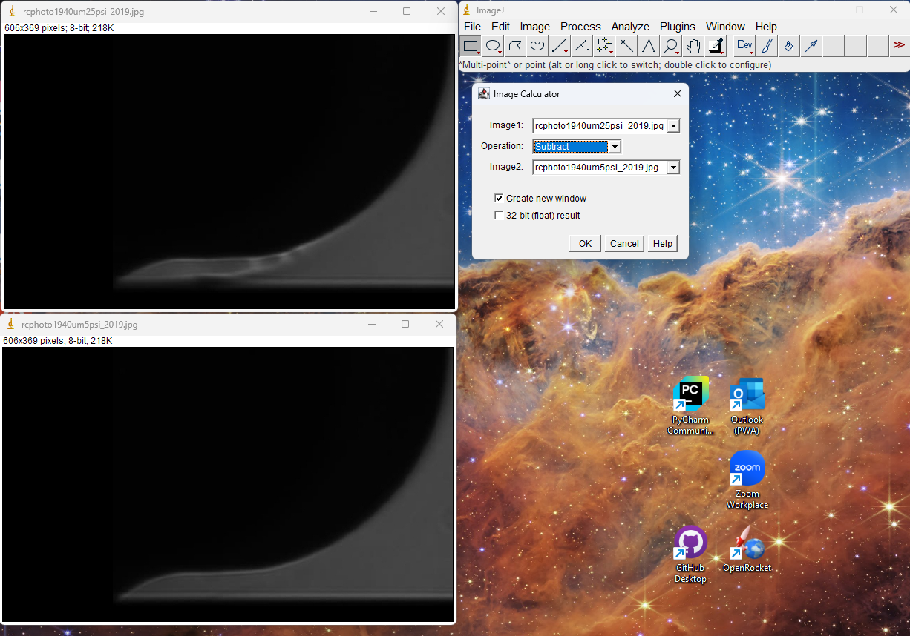
subtract images

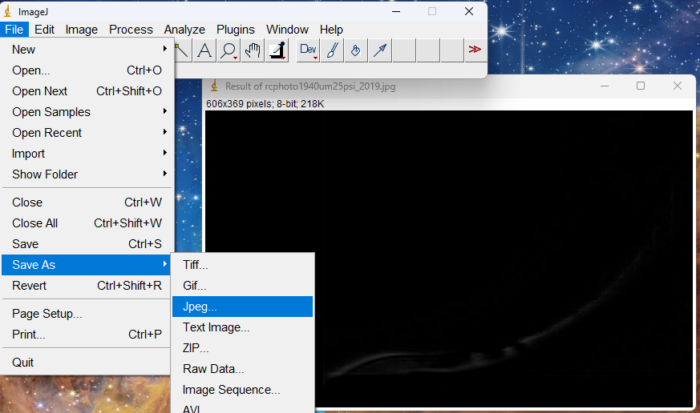
Save the result to a Jpeg

After image taring it may be necessary to mask out unwanted artifacts

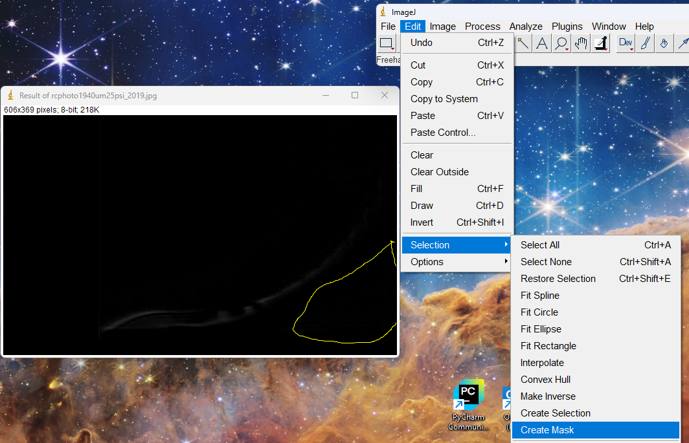
One can free select an area on an image as seen in the image above and select create mask

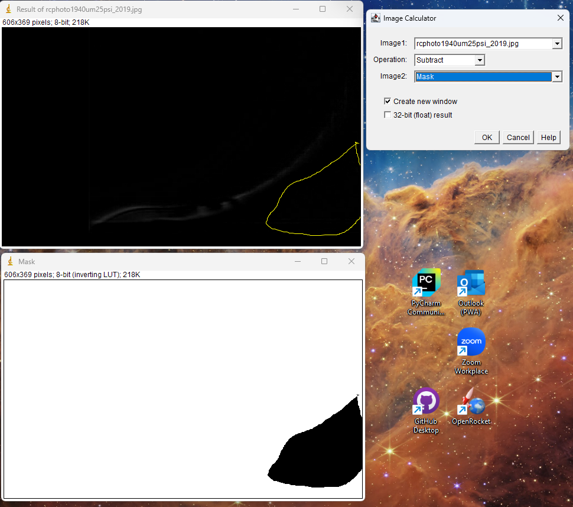

Finally, subtract the mask to remove any unwanted artifacts in the selected region.

**Use of files**

_Canny find edge Calibration:_
This file allows one to select filter parameters and canney edge detection thresholds that work for a data set.
To use this file add a file path into the path array in line 25 and select the index of the path in line 36.
The apply canny method can be edited on line 17 to adjust the filter settings. The only parameter that seems to
impact the results is the d value in the bilateral filter.
Once the file is running, the slider bars can be used to adjust the edges until the edges of the jet are clear and other 
features are not right of the boundary.

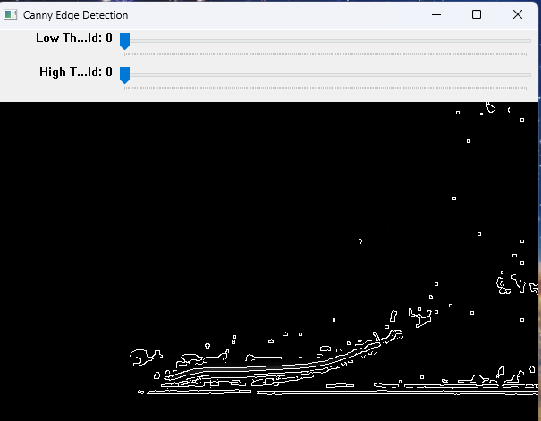

not great.

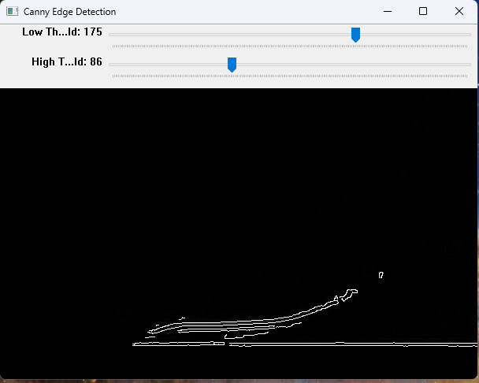

Thresholds adjusted until the edges are clear.

The results of the file can be used in Q1,Q2 and Q3.

_Q1:_
Demonstrates how the process works to get points on the Jet boundary edge.
To use change the file the program is referencing by changing the rawimg and image variables.
This file can be used to verify that parameters chosen will work through the entire process and choose what set of points 
to select. The extract_edges() method in this file can be adjusted to only grab points in a range of rows that result
in a clean boundary.
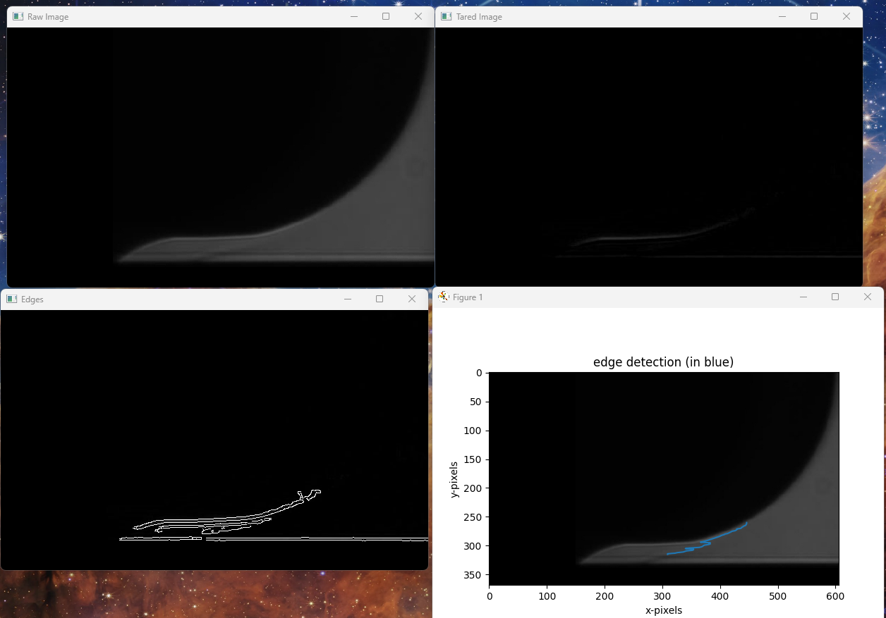

_Q2 & Q3_
The operation of both of these files is essentially the same
A list of pre-processed images should be created in a folder and the file path of the files should be stored in the path variable
and the list of file names should be stored in the slotpath or psipath arrays.
Apply any changes to the Canny edge detection thresholds and filters you found worked in the calibration file in the 
line 50-60 range.
The rows that final edge extraction can be run on can be adjusted in the same way that they were for Q1 by 
changing the thresholds on the first while loop in the extract_edges() method on lines 20 and 21.

The file shows a plot of the edge detection results for each file that must be closed by closing the window or pressing
'q'. 
The file then shows a plot of all the edge detection points together and all the lines of best fit together
the lines of best fit are printed out in the command window.

# sample results
Some Sample results are shown below

This answer is from the Q1 file. This shows the process and results of processing one file.
These results demonstrate that the analysis can be done and that the data set is generally appropriate for the task.

This is a sample of the results from the Q3 file showing the edge points and lines of best fit for all the files 
compared to each other.
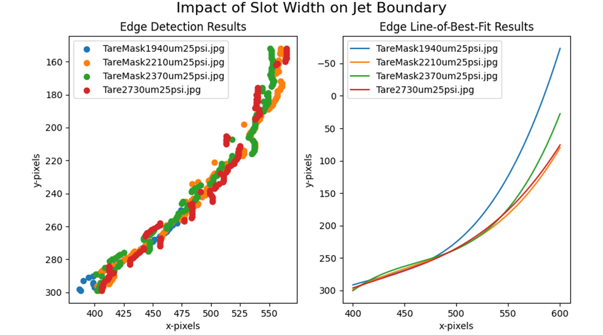

The lines of best fit from the above graph are printed below.

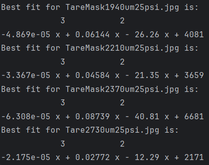

# program limitations
This program is limited only to pre-processed files
Currently the accuracy of the edge detection isn't amazing and I don't have a way to quantify it yet.
This project currently doesn't handle the pre-processing for you and doesn't churn through the entire data set.

# future work
In the future this project would be expanded to handle the file pre-processing and be able to move through the entire
data set automatically.
The final goal is a function of the slot width and pressure to predict the boundary. This would be meshed with 
some other work to model the shock cells and then the sound generation of the system.
I would also like to add error quantification to understand the performance of the linear regression and edge detection.

# References
[1]	C. P. Lubert, C. R. Schwantes, and R. J. Shafer, “An Investigation of Initial Shock Cell Formation in Turbulent Coanda Wall Jets,” IJAV, vol. 21, no. 2, 2016, doi: 10.20855/ijav.2016.21.2413.

[2]	C. P. Lubert, “Some recent experimental results concerning turbulent Coanda wall jets,” presented at the 167th Meeting of the Acoustical Society of America, Providence, Rhode Island, 2015, p. 040004. doi: 10.1121/2.0000040.

[3]	M.-Y. Chou et al., “Gigantic Circular Shock Acoustic Waves in the Ionosphere Triggered by the Launch of FORMOSAT-5 Satellite,” Space Weather, vol. 16, no. 2, pp. 172–184, 2018, doi: 10.1002/2017SW001738.

**Thanks to Dr. Lubert for the dataset**